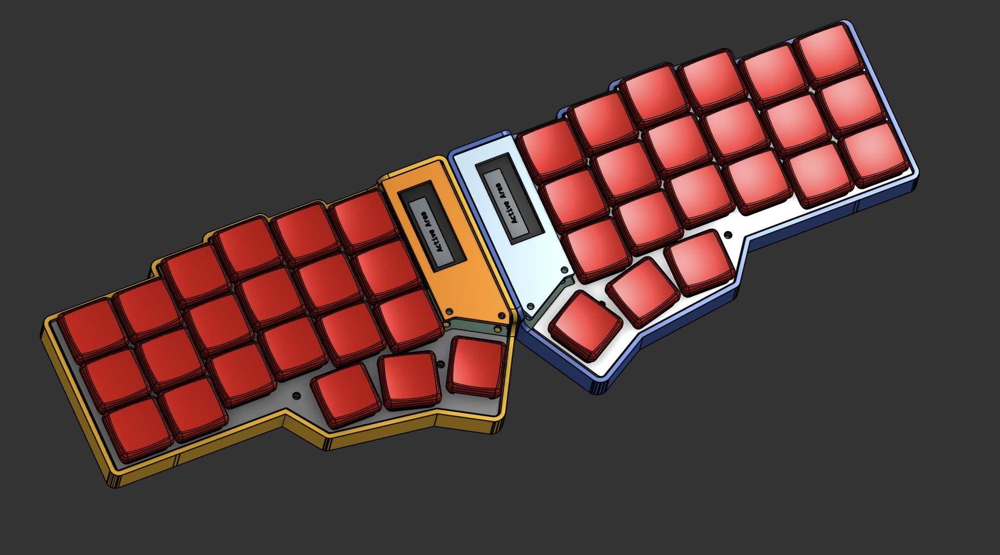
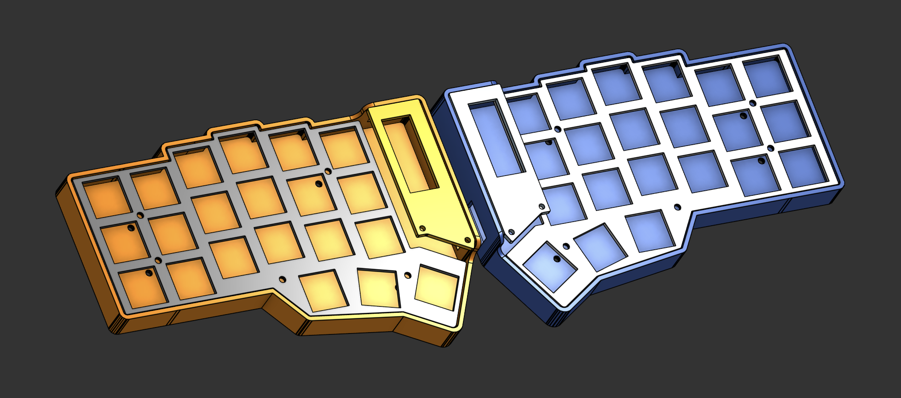
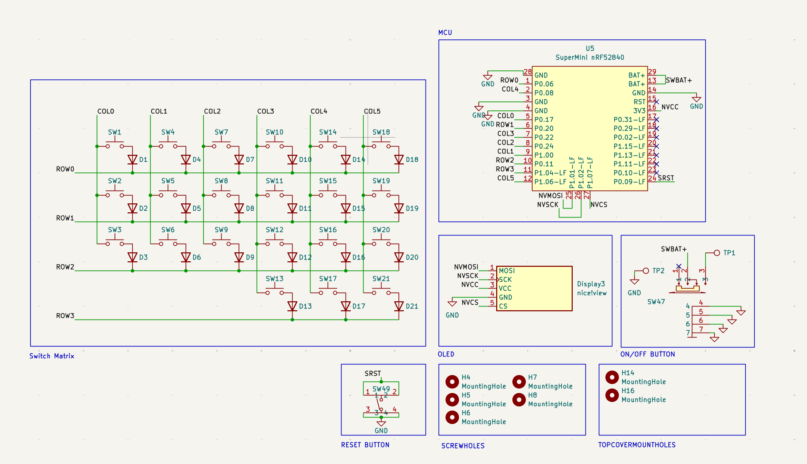
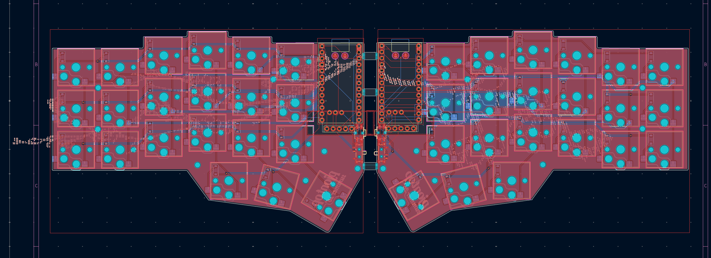

# PJBOARD!!!

PJBoard is a low-profile, wireless split keyboard with 42 keys, two displays, and a very very thin case!

I made this because I wanted something that had the clean look of keyboards like the Geist Totem and the portability of the Voyager, but with a few more keys so it would be easier for me to actually learn how to use a split keyboard. Basically: how close can I get to the MacBook Pro of keyboards?

It uses Kailh Choc switches, two SuperMini nRF52840 controllers, nice!view displays, and ZMK firmware. Each half is completely wireless and has its own battery, power switch, and reset button.

## Features

- 42-key split layout: 3 rows of 6 keys and 3 thumb keys on each side
- Low-profile Kailh Choc switches
- Hotswap sockets, because desoldering an entire keyboard would not be very fun
- Fully wireless using two SuperMini nRF52840 controllers
- A nice!view display on each half for status info
- A super thin, rounded case with hidden screws
- Separate base, plate, and display-cover pieces for each half
- Power and reset switches built directly into both PCBs
- Three ZMK layers: Base, Lower, and Raise

## CAD Model

The case was made in Onshape. I started by importing the PCB outline and building everything around it, which sounds simple until Onshape decides one switch model needs approximately one billion triangles and takes four hours to import :sob:

The final case is made from three parts per side: the base, the switch plate, and the display cover. I wanted it to be really thin, rounded, and clean, so the mounting hardware is hidden and the top pieces sit flush with the case. There are also cutouts underneath the larger components so the case does not need to be unnecessarily chonky.

You can view and remix the original CAD here: **[PJBoard on Onshape](https://cad.onshape.com/documents/bca79db99613f7f3e83bd048/w/cf08fbd1a130c559ac00717d/e/9940d6e044f49ffd99b80cc9?renderMode=0&uiState=6a8a41c1502d0c8b6353df97)**

## PCB

Here is the PCB! It was designed in KiCad and it was definitely the largest rabbit hole in this entire project.

Each half uses a 4x6 key matrix with 21 populated positions, one diode per key, a SuperMini nRF52840, a nice!view header, an on/off switch, and a reset button. I moved the diodes into the centre control area to keep the switch area clean and used both copper layers to make the matrix routing actually possible.

The two halves are panelized together with breakaway tabs, so they can be manufactured as one PCB and snapped apart afterward. Fire, right?

## Firmware Overview

PJBoard runs [ZMK](https://zmk.dev/) since the keyboard is wireless. Prebuilt firmware for both halves is included in the [`firmware`](firmware/) folder, along with the source configuration.

The current keymap has three layers:

- **Base:** the normal QWERTY layout
- **Lower:** numbers, arrow keys, and Bluetooth controls
- **Raise:** symbols and brackets

The two thumb layer keys make it possible to keep the board at only 42 keys without losing all the useful stuff. The displays stay visible while the keyboard is awake and show the current keyboard status.

## BOM

Here should be the main stuff you need to build PJBoard:

A better BOM Can be found in the bom.csv in the main directory, this is merely meant for a rough look over.

- 42x Kailh Choc low-profile switches
- 42x Kailh Choc hotswap sockets
- 42x low-profile keycaps
- 42x SOD-123 diodes
- 2x SuperMini nRF52840 controllers
- 2x nice!view displays
- 2x small LiPo batteries
- 2x SMD power switches
- 2x SMD reset buttons
- 1x left/right PCB set
- 1x printed case set (left and right base, plate, and display cover)
- M2 hardware for mounting the PCBs and case parts

## Things I Learnt

This was my first time going this deep into designing a keyboard, and I learnt a TON.

- How keyboard matrices actually work instead of just vaguely knowing that diodes exist
- How to make and edit custom KiCad symbols and footprints
- How to route a two-layer split keyboard PCB without creating a heavenly amount of vias
- How to use multi-channel design tools instead of manually mirroring everything for 40 minutes
- How to bring a PCB outline into Onshape and design a case around the real dimensions
- How much the angle, stagger, and thumb position matter when designing for actual hands
- How ZMK separates boards, shields, keymaps, and configuration files (the naming absolutely did not help at first)
- That testing a layout before committing to the PCB saves a LOT of pain later

## Challenges I Faced

KiCad was the main villain here. I redesigned the PCB more than once, moved all the diodes around, fought with mirrored layouts, installed a plugin that did not even do what I needed, and eventually figured out a routing setup that was way cleaner. Sad reality: sometimes you really do just have to reroute the entire board.

The case also took a bunch of iteration. I wanted it thin, rounded, strong around the high-pressure keys, and completely clean from the top with no visible screws. Getting all of those things at once was much harder than sketching them, especially while keeping enough room for the hotswap sockets, batteries, controllers, and displays.

The firmware was another whole thing. ZMK is really powerful, but understanding boards vs shields, setting up both halves, fixing the matrix, and getting the displays working was WAY worse than I thought it would be. YouTube tutorials, random websites, and an unreasonable amount of debugging carried me through it.

Overall, though, I am super happy with how it turned out. I went from a rough idea and a hand sketch to a complete PCB, case, and working firmware setup. Very very fire.

## Thank You!

I am super thankful to [Hack Club](https://hackclub.com/) for funding this project and making it possible for me to actually build the weird keyboard I spent way too many hours obsessing over.

Also, Macondo is awesome. Seriously. Programs like this are the reason I can learn hardware by actually making something real instead of just watching another tutorial and forgetting everything five minutes later.

alr toodles :3

